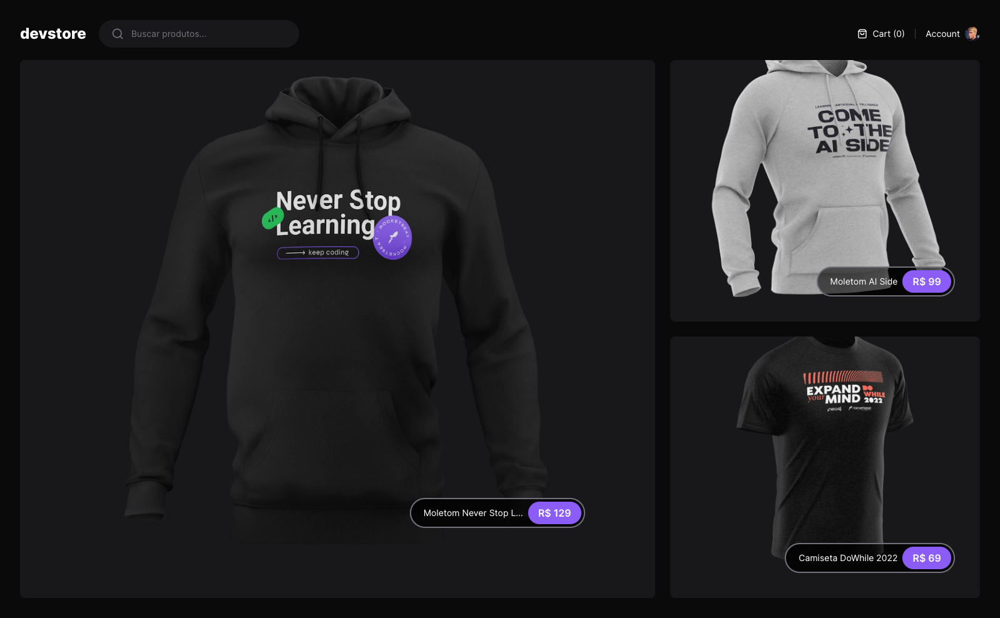
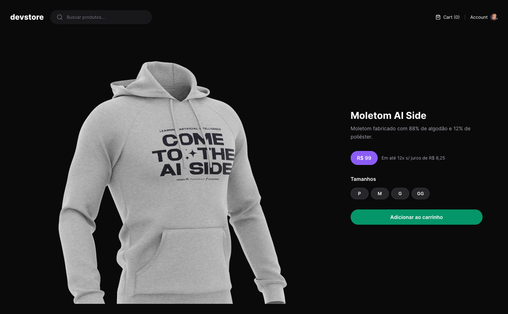

<p align="center" style="font-size: 2rem;font-weight: bold;">
  devstore
</p>

<p align="center">
  
  
  
  
</p>

<p align="center">
 <a href="#-sobre-o-projeto">Sobre</a> •
 <a href="#-layout">Layout</a> • 
 <a href="#-tecnologias-utilizadas">Tecnologias</a> • 
 <a href="#-instalação-e-uso">Instalação</a> • 
 <a href="#-executando-testes-e2e">Testes</a>
</p>

<h4 align="center"> 
	🚧  Projeto finalizado 🚀 🚧
</h4>

## 💻 Sobre o projeto

O objetivo principal deste projeto é explorar os recursos avançados do Next.js 14 e aplicá-los em um contexto prático de e-commerce. Além disso, visa aprofundar o entendimento de conceitos como roteamento dinâmico, geração estática e dinâmica de páginas, otimização de desempenho, entre outros aspectos essenciais para a construção de aplicações web modernas e eficientes.

## 🎨 Layout

<p align="left">       
  
  
</p>

## 🔨 Tecnologias utilizadas

As seguintes ferramentas foram usadas na construção do projeto:

- **[Next14](https://nextjs.org/)**
- **[TypeScript](https://www.typescriptlang.org/)**
- **[TailwindCSS](https://tailwindcss.com/)**
- **[Cypress](https://www.cypress.io/)**
- **[Zod](https://zod.dev/)**

> Veja o arquivo [package.json](https://github.com/viniciussgp/devstore-next14/blob/main/package.json)

## 🚀 Instalação e uso

```bash
# Clone o repositório
git clone https://github.com/viniciussgp/devstore-next14.git

# Acesse a pasta do projeto
cd devstore-next14

# Instale as dependências
yarn install

# Execute a aplicação
yarn dev
```

## 🧭 Executando testes E2E

```bash
# Com o front-end rodando. Execute o seguinte comando:

npx cypress open

# Configure o teste E2E de acordo com o seu navegador de preferência, e clique em continuar.
```

---

Feito com 💜 por [Vinícius Alves](https://github.com/viniciussgp)